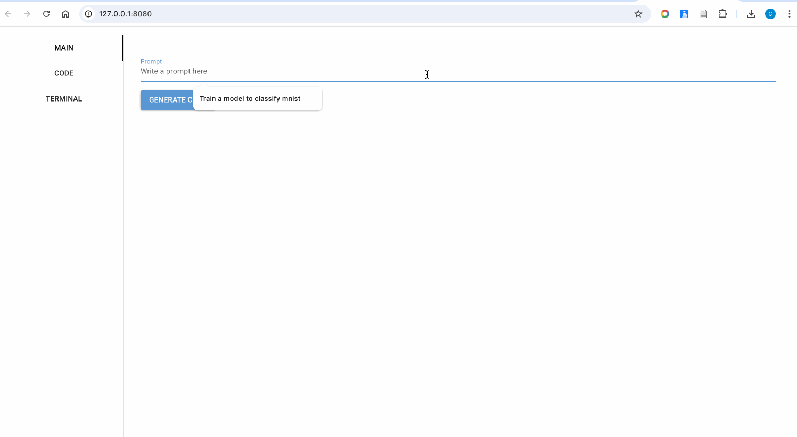
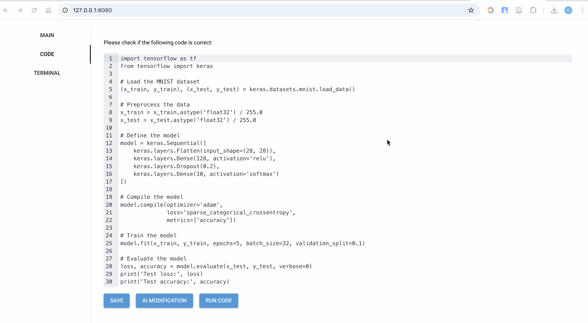
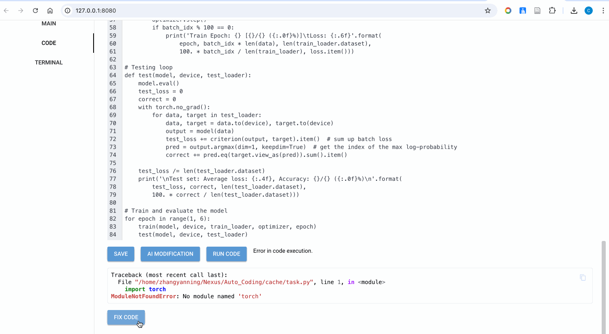

# Auto Coding
This is an LLM-based Auto-coding project.

## Installation
Conda:
```sh
conda create --name <your_env> --file requirements.txt
conda activate your_env
```

## Quick Start
Create a config.yaml file in the main directory like:
```yaml
api: <your api>
base_url (optional): <base url for your api>
```
Then, run:
```sh
python main.py
```

## Functions

### Automatically generate the code



### Modify the code as you want:



### Fix the error easily:

